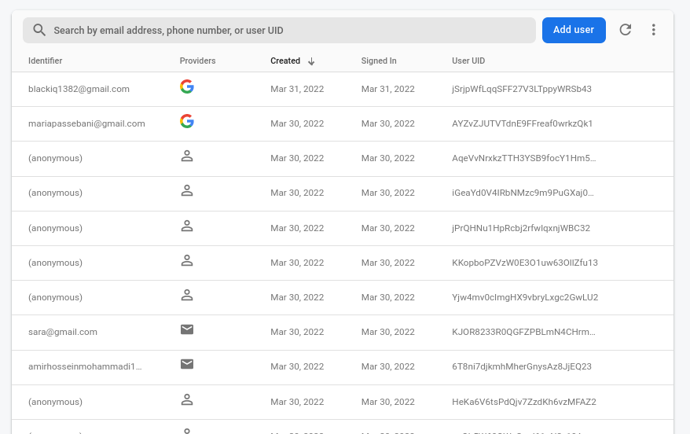

# Time Tracker | Flutter

Time tracker is a cloud based task manager where you can manage your tasks in your mobile or web browser in a same time or in a most appropriate way, **Real-time**.

## How?

The Back-End for both web and mobile platform is by **Google Firebase services**. So there is no worry about missing data, authentication and any other things.

## Web application

Web application of Time-Tracker is also open source and created with ReactJs. You can see the links below:

- [Github source](https://github.com/BlackIQ/TimeTracker-React)
- [Application in Firebase Hosting](https://time-tracker-f3ebc.firebaseapp.com) - 1
- [Application in Firebase Hosting](https://time-tracker-f3ebc.web.app) - 2

## Firebase

Firebase is a cloud service provider for many frameworks. Like **Authentication**, **Cloud Firestore** and **Hosting**.

### Authentication


Authentication with Firebase is so easy. You can turn on Auth providers in your project part in Firebase and add their methods in your source project.

Our application has 3 ways to authenticating.


In the Firebase authentication part, there is a part you can see users and the uid.



#### Email & Password Authentication

 

You can use your Email and Password to register or login. There is also a way to reset your password.

#### Google Authentication

If you have a Google account, you can easily authenticate with your Google account.

#### Anonymous Authentication

If you want to use the app as a guest or testing app, you can use Anonymous authentication where you don't need to have any Google account or any other emails.

### Firestore

As we said before, we save data in **Firestore**. Firestore is a NoSQL database, there are 2 collections that I will describe them.

#### Tasks collection


In this collection, there are task documents. Every document has 4 keys. Like a Json file.

```json
{
  "uid": "user uid",
  "status": true,
  "created": "Time stamp",
  "name": "Task name"
}
```

The `status` can be `true` or `false`.

#### Users collection


There are only 2 items that store in users collection.

```json
{
  "user": "user id",
  "name": "user name"
}
```

If user authenticate with Google account, the `name` will be your Google account name. If not, the `null` will be store in that field.

> Name can change in your panel.

### Hosting

App is hosting in **Firebase Hosting**. More details are described in the end of the document.

## Application pages


Application has 3 pages. Home, Add and Settings.

### Home page


Home page returns a list view of tasks.

#### Task

Each list tile has a checkbox that shows that task is done or not. In side of checkbox, there is the task name.


### Add page


Here is a part where yu can easily add your tasks.

### Settings page


In settings you can access to your data and changing them.

> This feature is only available in Web application.

## Download the app

You can download the app from this repository release.

> Links will be added soon. Now there is no release.